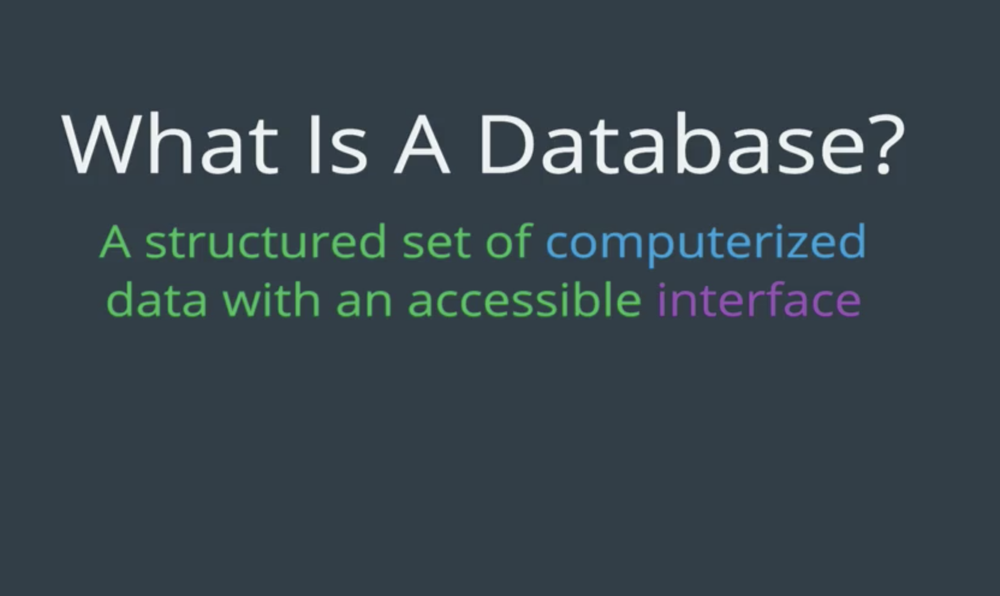
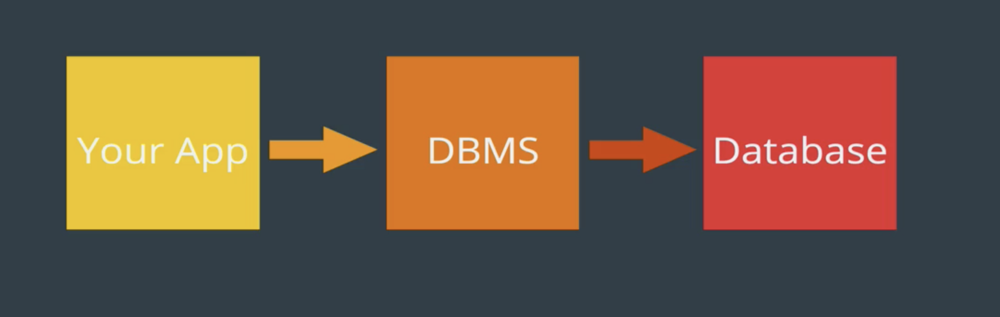
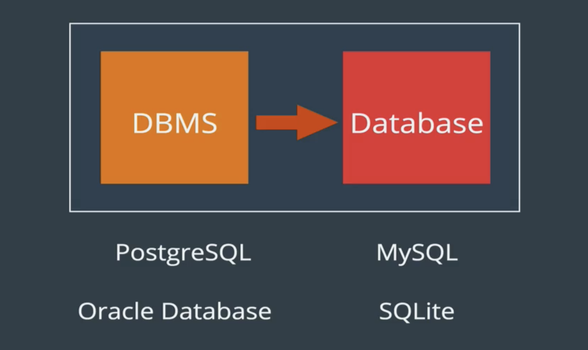

# sql-bootcamp

What is a database? 

It's a collection of data! there are all sorts of collections of data in the real world (ie a medical record at the GP)

Database V Database Management System

The former is a huge collection of data but it doesn't really do much on it's own (you can almost view it as a gigantic file on your machine). 
DBMS allows us to interface with the DB mainly for CRUD operations. It's just the code or programme that does the talking to our database for us. We talk to our database management system, and it talks to our database. 

Your giving commands to the DBMS which then gives commands ot the DB itself. 

### Difference between SQL and MySql

Structured Query Language - is the language we use to 'talk' to our databases.